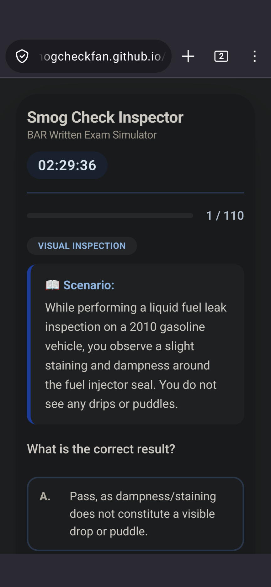
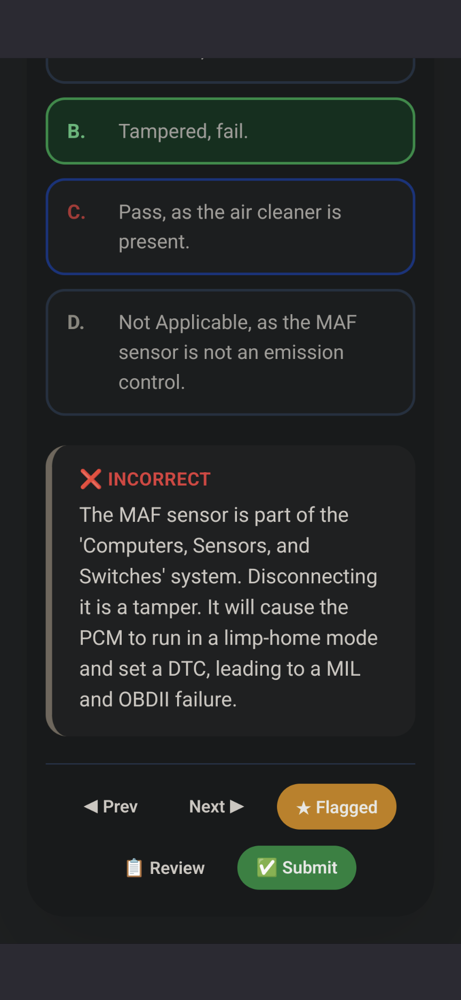
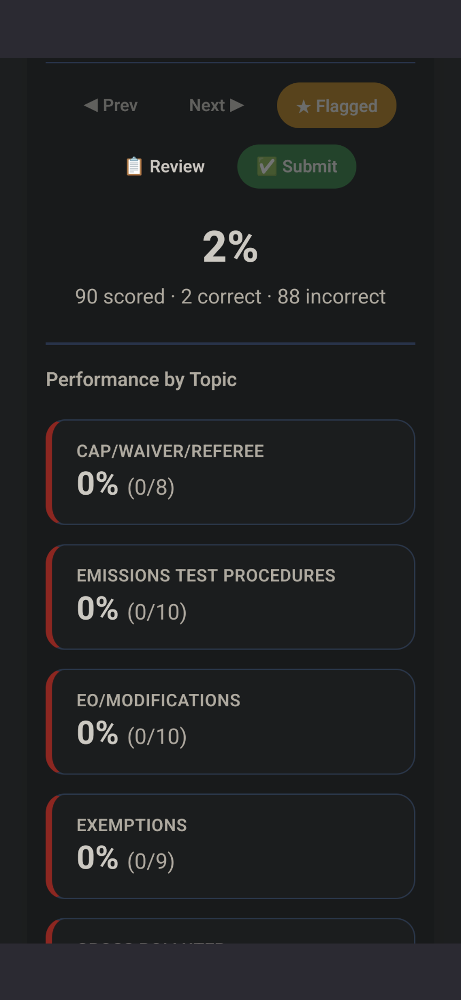
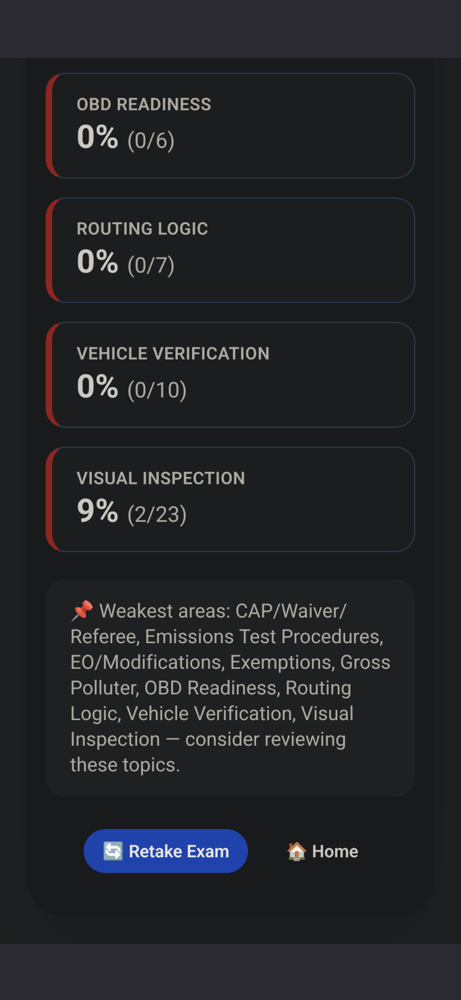

# BAR Smog Check Inspector – Exam Simulator

A free, fully functional practice exam simulator for the California **BAR Smog Check Inspector** certification.


---

## Overview

This simulator helps candidates prepare for the California Bureau of Automotive Repair (BAR) Smog Check Inspector certification exam. It runs entirely in your browser — no installation, account, or internet connection required after loading.

The question bank contains **320 original, synthetic questions** covering the full range of exam topics, authored by a BAR-certified Inspector (Level 1 & 2) and validated through independent review.

## Screenshots

<p align="center">
  
  &nbsp;&nbsp;
  
</p>
<p align="center">
  
  &nbsp;&nbsp;
  
</p>

<p align="center">
  <em>Timed scenario questions · instant explanations · per-topic performance breakdown</em>
</p>

## Features

- **Timed exam mode** — 150-minute limit, mirroring real exam conditions
- **Randomized question sets** — 110 questions per attempt (90 scored, 20 unscored)
- **Scenario-based questions** with realistic inspection situations
- **Instant feedback** and detailed explanations on every answer
- **Question flagging** for later review
- **Topic performance breakdown** that highlights your weakest areas
- **Auto-save progress** to your browser
- **Mobile responsive** design
- No installation, no login, no ads

## Getting Started

No build step or dependencies are required.

1. Download the repository, or clone it:
   ```bash
   git clone https://github.com/SmogCheckFan/BAR-Smog-Inspector-Simulator.git
   ```
2. Open `index.html` in any modern web browser.
3. Click **Start Exam**.
4. Complete your practice test.
5. Review your performance breakdown.

You can also try it directly in your browser via GitHub Pages: **https://smogcheckfan.github.io/BAR-Smog-Inspector-Simulator/**

## Disclaimer

This is an **unofficial study aid** and is not affiliated with, endorsed by, or sponsored by the California Bureau of Automotive Repair (BAR) or any state agency. All questions are original and synthetically generated for practice purposes only; they do not reproduce actual exam content. Always consult official BAR materials and current regulations when preparing for certification.

## Contributing

Contributions, corrections, and suggestions are welcome. Please open an issue to report an error or propose an improvement, or submit a pull request.

## License

Released under the [MIT License](LICENSE) — free to use, modify, and distribute.

---

Built by **SmogCheckFan**, 2026.

